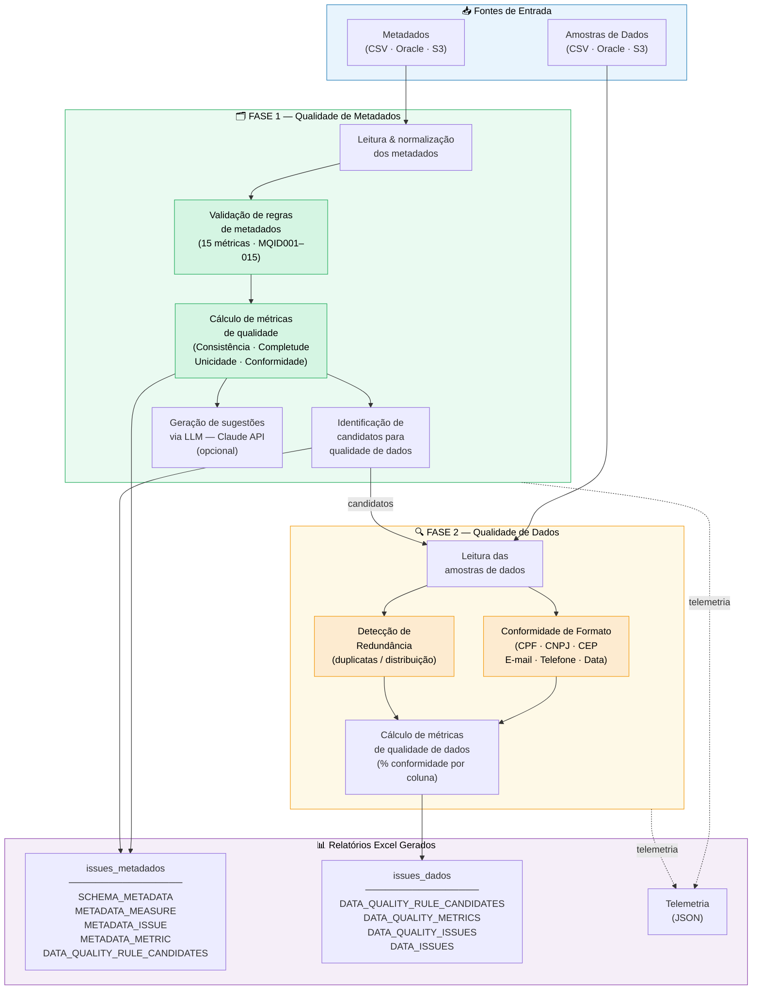

# Diagrama de Fases do Sistema de Qualidade de Dados

Para renderizar: cole o bloco abaixo em https://mermaid.live ou use a extensão "Markdown Preview Mermaid Support" no VS Code.

---



---

## Versão em tabela (para montar em PowerPoint / Draw.io)

### Etapas do Processo — Metadados

| Nº | Etapa | Módulo Principal | Saída |
|----|-------|-----------------|-------|
| 1 | Leitura & normalização dos metadados | `MetadataSourceBuilder` | DataFrame de metadados |
| 2 | Validação de regras de metadados (15 métricas) | `MetadataValidator` | Lista de issues por tabela/coluna |
| 3 | Cálculo de métricas de qualidade | `MetadataQualityMetricsCalculator` | MQID001–015 (% conformidade) |
| 4 | Identificação de candidatos de dados | `MetadataValidator` (candidatos) | Lista de colunas candidatas |
| 5 | Geração de sugestões via LLM (opcional) | `MetadataIssueSuggester` + Claude API | Descrições em linguagem natural |
| 6 | Exportação do relatório Excel | `ExcelReportExporter` | `issues_metadata_<esquema>.xlsx` |

### Etapas do Processo — Dados

| Nº | Etapa | Módulo Principal | Saída |
|----|-------|-----------------|-------|
| 1 | Leitura das amostras de dados | `SampleSource` (CSV/Oracle/S3) | DataFrame de amostras |
| 2 | Validação de conformidade de formato | `DataQualityValidator` + `DocumentCodeClassifier` | Valores válidos / inválidos / ambíguos |
| 3 | Detecção de redundância | `DataQualityValidator` (redundância) | Estatísticas de distribuição |
| 4 | Cálculo de métricas de dados | `DocumentCodeQualityAnalyzer` | % conformidade por coluna |
| 5 | Exportação do relatório Excel | `ExcelReportExporter` | `issues_dados_<esquema>.xlsx` |

---

## Diagrama simplificado — fluxo linear (para slides)

```
┌─────────────────────────────────────────────────────────────────────────┐
│                         ENTRADAS                                        │
│         Metadados (CSV / Oracle / S3)   Amostras (CSV / Oracle / S3)   │
└──────────────────┬──────────────────────────────┬───────────────────────┘
                   │                              │
                   ▼                              │
    ╔══════════════════════════════╗              │
    ║  FASE 1 — METADADOS          ║              │
    ║  ① Leitura & normalização    ║              │
    ║  ② Validação de regras       ║──candidatos──┤
    ║  ③ Cálculo de métricas       ║              │
    ║  ④ Sugestões via LLM (opt.)  ║              │
    ╚══════════════════════════════╝              │
                   │                              ▼
                   │           ╔══════════════════════════════╗
                   │           ║  FASE 2 — DADOS              ║
                   │           ║  ① Leitura de amostras       ║
                   │           ║  ② Conformidade de formato   ║
                   │           ║  ③ Detecção de redundância   ║
                   │           ║  ④ Cálculo de métricas       ║
                   │           ╚══════════════════════════════╝
                   │                              │
                   ▼                              ▼
    ┌──────────────────────┐    ┌──────────────────────────────┐
    │ issues_metadados.xlsx│    │    issues_dados.xlsx         │
    │ • METADATA_MEASURE   │    │ • DATA_QUALITY_METRICS       │
    │ • METADATA_ISSUE     │    │ • DATA_QUALITY_ISSUES        │
    │ • METADATA_METRIC    │    │ • DATA_ISSUES                │
    └──────────────────────┘    └──────────────────────────────┘
```
