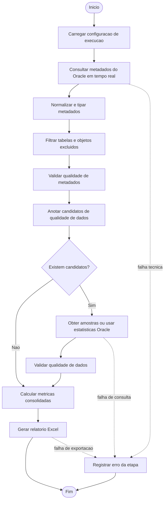

# Especificacao do Sistema com Foco em Fluxo Operacional e Desempenho

## 1. Objetivo do documento

Este documento especifica o sistema de qualidade de metadados e qualidade de dados em desenvolvimento neste repositorio, com enfase em:

- fluxo de atividades executadas pelo sistema, em formato textual semelhante a um fluxo BPMN;
- entradas e saidas de cada etapa;
- servicos providos pelo sistema;
- parametros de execucao que podem alterar a performance;
- pontos de medicao necessarios para uma futura analise de desempenho.

O documento considera como arquitetura-alvo a entrada de metadados diretamente do banco Oracle, em tempo real, embora a implementacao atual ainda utilize arquivos CSV como fonte principal de metadados.

## 2. Escopo funcional do sistema

O sistema possui dois fluxos principais:

1. Fluxo de qualidade de metadados
   Avalia padroes de nomenclatura, completude, integridade estrutural e consistencia estatistica dos metadados de um schema.

2. Fluxo de qualidade de dados orientado por candidatos
   A partir dos metadados, identifica colunas candidatas a verificacoes de qualidade de dados e executa validacoes sobre amostras de dados.

## 3. Visao arquitetural

### 3.1 Arquitetura atual

Na implementacao atual:

- os metadados sao carregados de arquivos `metadados_<schema>.csv`;
- as amostras de dados podem vir de CSV ou do banco;
- os resultados sao exportados para planilhas Excel.

### 3.2 Arquitetura-alvo para analise de desempenho

Para este documento, considera-se a arquitetura-alvo abaixo:

- os metadados sao consultados em tempo real no Oracle;
- as estatisticas do dicionario Oracle, como `NUM_ROWS`, `NUM_NULLS` e `NUM_DISTINCT`, chegam junto com os metadados;
- as amostras de dados tambem podem ser consultadas no Oracle;
- o sistema executa validacoes e gera artefatos analiticos para acompanhamento operacional e de desempenho.

## 4. Fluxo operacional em estilo BPMN textual

### 4.1 Participantes

- Usuario ou processo agendador
- Orquestrador do sistema
- Servico de leitura de metadados Oracle
- Servico de validacao de metadados
- Servico de selecao de candidatos a qualidade de dados
- Servico de leitura de amostras
- Servico de validacao de qualidade de dados
- Servico de calculo de metricas
- Servico de exportacao de relatorio
- Futuro servico de monitoramento de desempenho

### 4.2 Fluxo principal

1. Evento inicial
   O usuario ou agendador dispara a execucao para um ou mais schemas Oracle.

2. Carregar configuracao de execucao
   Entrada:
   parametros de conexao, schemas-alvo, filtros de exclusao, limites de amostragem e configuracoes de validacao.
   Saida:
   contexto de execucao validado.

3. Consultar metadados em tempo real no Oracle
   Entrada:
   schema alvo, credenciais, query de metadados, filtros.
   Processamento:
   leitura do catalogo Oracle e enriquecimento com estatisticas disponiveis.
   Saida:
   conjunto de metadados por schema, tabela e coluna.

4. Normalizar e preparar metadados
   Entrada:
   dataset bruto de metadados.
   Processamento:
   padronizacao de nomes, coercao de tipos, derivacao de flags como PK, FK e UK, remocao de colunas irrelevantes.
   Saida:
   dataframe de metadados estruturado.

5. Filtrar objetos excluidos
   Entrada:
   metadados estruturados e lista de exclusao.
   Decisao:
   tabela deve ser processada?
   Saida:
   subconjunto efetivo de tabelas e colunas.

6. Executar validacao de qualidade de metadados
   Entrada:
   metadados estruturados e regras configuradas.
   Processamento:
   verificacoes de nomenclatura, comentarios ausentes, constraints, cobertura de integridade e aderencia tipo-nome.
   Saida:
   lista de issues de metadados e contadores auxiliares.

7. Anotar candidatos a validacao de qualidade de dados
   Entrada:
   metadados estruturados.
   Processamento:
   identificacao de colunas candidatas a:
   conformidade de formato e deteccao de redundancia.
   Saida:
   lista de candidatos e seu metodo previsto de calculo.

8. Gateway de decisao
   Existem candidatos de qualidade de dados?
   Se nao:
   seguir para calculo de metricas de metadados e geracao de saida.
   Se sim:
   continuar.

9. Obter amostras de dados ou usar estatisticas do Oracle
   Entrada:
   lista de candidatos, schema, tabela, estrategia de obtencao.
   Processamento:
   para candidatos com estatisticas suficientes, usar metadados;
   para candidatos que exigem leitura de valores, executar consultas no Oracle com limite configurado.
   Saida:
   amostras por tabela e colunas associadas.

10. Executar validacao de qualidade de dados
    Entrada:
    candidatos e amostras.
    Processamento:
    verificacao de conformidade de formato, duplicidade e unicidade.
    Saida:
    metricas calculadas e issues de qualidade de dados.

11. Calcular metricas consolidadas
    Entrada:
    issues, contadores estruturais e estatisticas do schema.
    Processamento:
    agregacao de indicadores de qualidade de metadados e qualidade de dados.
    Saida:
    tabelas de metricas consolidadas.

12. Gerar relatorio analitico
    Entrada:
    metadados anotados, candidatos, issues, metricas e medidas.
    Saida:
    artefato Excel por schema e, idealmente, telemetria operacional.

13. Evento final
    Execucao concluida com sucesso ou com falhas parciais registradas.

### 4.3 Fluxos alternativos e excecoes

- Falha de conexao com Oracle:
  encerramento do schema com erro tecnico.
- Metadados sem colunas obrigatorias:
  schema rejeitado por inconsistencias de entrada.
- Candidato sem amostra disponivel:
  metrica marcada como `NOT_AVAILABLE`.
- Coluna candidata ausente na amostra:
  issue operacional registrada.
- Tabela sem valores avaliaveis:
  metrica marcada como indisponivel.

### 4.4 Diagrama BPM visual

## 5. Entradas e saidas por macroetapa

| Macroetapa | Entradas principais | Saidas principais |
| --- | --- | --- |
| Configuracao | JSON, argumentos CLI, parametros Oracle | contexto de execucao |
| Ingestao de metadados | schema, credenciais, query, filtros | metadados brutos |
| Preparacao | metadados brutos | metadados tipados e normalizados |
| Validacao de metadados | metadados preparados, regras | issues, medidas, candidatos |
| Coleta de amostras | candidatos, conexao Oracle, `sample_limit` | amostras por tabela |
| Validacao de dados | candidatos, amostras ou estatisticas | metricas e issues de dados |
| Consolidacao | medidas, issues, candidatos | tabelas analiticas |
| Exportacao | secoes consolidadas | arquivo Excel e, futuramente, logs de desempenho |

## 6. Servicos providos pelo sistema

### 6.1 Servico de ingestao de metadados

Responsabilidade:
obter, normalizar e disponibilizar os metadados por schema.

Entradas:

- schema alvo;
- string de conexao Oracle;
- estrategia de autenticacao;
- consulta SQL de metadados;
- colunas a descartar;
- filtros de exclusao.

Saidas:

- dataframe de metadados tipado;
- indicadores de volume de entrada, como quantidade de tabelas e colunas.

### 6.2 Servico de validacao de qualidade de metadados

Responsabilidade:
avaliar a aderencia dos metadados a regras de padrao estrutural e semantico.

Entradas:

- metadados tipados;
- configuracao de validacao.

Saidas:

- issues de metadados;
- medidas estruturais;
- anotacoes auxiliares para metricas.

### 6.3 Servico de identificacao de candidatos a qualidade de dados

Responsabilidade:
marcar colunas que merecem verificacao de formato ou redundancia.

Entradas:

- metadados tipados;
- regras semanticas de formato;
- estatisticas de cardinalidade e nullidade.

Saidas:

- lista de candidatos;
- metodo de calculo sugerido:
  `METADATA_STATISTICS` ou `DATA_SCAN_REQUIRED`.

### 6.4 Servico de leitura de amostras de dados

Responsabilidade:
recuperar amostras das tabelas candidatas.

Entradas:

- schema;
- tabela;
- conexao Oracle;
- query template;
- limite de linhas.

Saidas:

- dataframe por tabela;
- falhas de leitura associadas a schema/tabela.

### 6.5 Servico de validacao de qualidade de dados

Responsabilidade:
avaliar formato, duplicidade e unicidade nas colunas candidatas.

Entradas:

- candidatos anotados;
- amostras ou estatisticas de metadados.

Saidas:

- metricas de qualidade de dados;
- issues por coluna;
- exemplos invalidos limitados.

### 6.6 Servico de calculo de metricas consolidadas

Responsabilidade:
transformar medidas e issues em indicadores percentuais e contagens consolidadas.

Entradas:

- contadores estruturais;
- issues;
- regras de composicao de indicadores.

Saidas:

- `METADATA_MEASURES`;
- `METADATA_METRICS`;
- `DATA_QUALITY_METRICS`.

### 6.7 Servico de exportacao de relatorios

Responsabilidade:
persistir os resultados em artefatos consumiveis.

Entradas:

- secoes de relatorio por schema.

Saidas:

- arquivo Excel versionado com timestamp.

### 6.8 Servico de monitoramento de desempenho

Responsabilidade:
coletar tempos, volumes, falhas e consumo de recursos por etapa.

Estado atual:
nao implementado.

Saidas desejadas:

- tempo total por schema;
- tempo por etapa;
- quantidade de linhas lidas do Oracle;
- quantidade de candidatos processados;
- quantidade de consultas executadas;
- volume exportado;
- taxa de falhas por etapa.

## 7. Parametros de execucao com potencial de impacto em performance

### 7.1 Parametros de conectividade e consulta Oracle

- `db_connection_uri`
  Afeta latencia de conexao, autenticacao e roteamento.
- `db_authentication_type`
  Pode adicionar custo extra de autenticacao.
- `db_driver_class_name`
  Impacta stack de acesso e overhead do driver.
- `sample_query_template`
  Influencia plano de execucao SQL, uso de indices e trafego de dados.
- query de metadados em tempo real
  Define custo total de leitura do catalogo Oracle.

### 7.2 Parametros de volume de processamento

- quantidade de schemas processados por execucao;
- quantidade de tabelas por schema;
- quantidade de colunas por tabela;
- percentual de colunas candidatas a qualidade de dados;
- `sample_limit`;
- quantidade de tabelas excluidas por `exclude_tables`.

### 7.3 Parametros de regras de validacao

- `prefix_names`;
- `max_table_len`;
- `max_column_len`;
- `identifier_name_patterns`;
- `named_length_rules`;
- regras semanticas de formato;
- criterios de redundancia.

Quanto maior o conjunto de regras e maior a densidade de candidatos, maior tende a ser o custo de CPU e de iteracao sobre linhas.

### 7.4 Parametros de saida

- numero de abas exportadas para Excel;
- volume de linhas nas abas de issues e candidatos;
- largura media textual das colunas, que afeta autoajuste;
- quantidade de schemas exportados na mesma execucao.

### 7.5 Parametros derivados do proprio dado

- presenca de `NUM_ROWS`, `NUM_NULLS` e `NUM_DISTINCT`;
- distribuicao de nulls;
- cardinalidade das colunas;
- existencia de tabelas muito grandes;
- existencia de colunas textuais muito extensas;
- presenca de muitas constraints em formato textual.

Esses fatores alteram a quantidade de trabalho local e o volume de consultas adicionais ao banco.

## 8. Principais fatores que mudam a performance do sistema

### 8.1 Fatores que aumentam latencia

- abrir uma conexao ao banco a cada execucao ou a cada etapa;
- consultar muitas tabelas individualmente;
- usar `SELECT *` em amostras quando poucas colunas seriam suficientes;
- processar muitos candidatos que exigem `DATA_SCAN_REQUIRED`;
- exportar planilhas muito grandes;
- executar validacoes linha a linha sem vetorizacao adicional.

### 8.2 Fatores que reduzem latencia

- reaproveitar estatisticas Oracle quando disponiveis;
- reduzir candidatos por meio de filtros de schema e tabela;
- limitar amostras com `sample_limit`;
- buscar apenas colunas necessarias nas amostras;
- manter conexao reutilizavel ao banco;
- medir tempo por etapa para detectar gargalos reais.

### 8.3 Fatores que aumentam consumo de memoria

- carregar metadados de muitos schemas de uma vez;
- manter amostras de muitas tabelas simultaneamente em memoria;
- gerar dataframes intermediarios duplicados;
- escrever grandes planilhas com varias abas no mesmo processo.

## 9. Indicadores de desempenho recomendados

Para que o sistema possa ser analisado sob a perspectiva de performance, recomenda-se registrar pelo menos:

- tempo total da execucao;
- tempo por schema;
- tempo de leitura de metadados;
- tempo de normalizacao e tipagem;
- tempo de validacao de metadados;
- tempo de identificacao de candidatos;
- tempo de leitura de amostras por tabela;
- tempo de validacao de qualidade de dados por candidato;
- tempo de exportacao do Excel;
- quantidade de tabelas lidas;
- quantidade de colunas lidas;
- quantidade de candidatos gerados;
- quantidade de consultas Oracle executadas;
- linhas retornadas por consulta;
- quantidade de issues geradas;
- memoria maxima consumida no processo;
- falhas tecnicas por etapa.

## 10. Gargalos provaveis na arquitetura-alvo

### 10.1 Ingestao de metadados Oracle

Se a consulta ao catalogo Oracle trouxer muitos schemas, tabelas ou estatisticas detalhadas de uma so vez, essa etapa tende a dominar o tempo total.

### 10.2 Leitura de amostras por tabela

Na arquitetura atual de validacao, as amostras sao buscadas por tabela candidata. Em schemas com muitas tabelas candidatas, isso pode gerar grande quantidade de round-trips ao banco.

### 10.3 Validacao iterativa em Python

Parte relevante das validacoes percorre linhas do dataframe. Em grandes volumes de colunas ou candidatos, isso pode crescer linearmente e se tornar gargalo de CPU.

### 10.4 Exportacao Excel

A escrita de varias abas com autoajuste de largura tende a ser cara quando ha muitas linhas e colunas textuais extensas.

## 11. Lacunas atuais para analise de desempenho

Atualmente o sistema nao implementa:

- telemetria por etapa;
- contadores tecnicos de throughput;
- medicao de uso de memoria;
- logging estruturado por schema e tabela;
- comparacao entre tempo gasto em Oracle e tempo gasto em processamento local;
- acompanhamento de variacao de performance por parametro de execucao.

Sem esses dados, a analise de desempenho fica limitada a observacoes empiricas.

## 12. Pontos do codigo para instrumentacao de metricas

### 12.1 Metricas de tempo

#### Tempo total de execucao

Ponto principal:

- [run_data_quality.py](/d:/Users/49756615/Documents/DoutoradoUFC/Implementation/dataquality/run_data_quality.py#L34)
  Medir no inicio e no fim de `main()`.

Pontos complementares:

- [app/use_cases/run_data_quality.py](/d:/Users/49756615/Documents/DoutoradoUFC/Implementation/dataquality/app/use_cases/run_data_quality.py#L34)
- [app/use_cases/run_model_quality.py](/d:/Users/49756615/Documents/DoutoradoUFC/Implementation/dataquality/app/use_cases/run_model_quality.py#L25)

Recomendacao:
usar `time.perf_counter()` e registrar `execution_start`, `execution_end` e `total_duration_ms`.

#### Tempo por schema

Pontos ideais:

- [app/use_cases/run_data_quality.py](/d:/Users/49756615/Documents/DoutoradoUFC/Implementation/dataquality/app/use_cases/run_data_quality.py#L48)
- [app/use_cases/run_model_quality.py](/d:/Users/49756615/Documents/DoutoradoUFC/Implementation/dataquality/app/use_cases/run_model_quality.py#L38)

Recomendacao:
iniciar a medicao logo antes do processamento de cada schema e finalizar apos a exportacao do relatorio.

#### Tempo de validacao em Python

Para qualidade de metadados:

- [domain/validators/metadata_validator.py](/d:/Users/49756615/Documents/DoutoradoUFC/Implementation/dataquality/domain/validators/metadata_validator.py#L352)
  Medir o tempo total de `run_all()`.

Para anotacao de candidatos:

- [app/use_cases/run_data_quality.py](/d:/Users/49756615/Documents/DoutoradoUFC/Implementation/dataquality/app/use_cases/run_data_quality.py#L58)
  Medir a duracao de `annotate_data_quality_candidates`.

Para qualidade de dados:

- [domain/validators/data_quality_validator.py](/d:/Users/49756615/Documents/DoutoradoUFC/Implementation/dataquality/domain/validators/data_quality_validator.py#L18)
  Medir o tempo total de `validate_candidates()`.

Detalhamento adicional:

- [domain/validators/data_quality_validator.py](/d:/Users/49756615/Documents/DoutoradoUFC/Implementation/dataquality/domain/validators/data_quality_validator.py#L76)
  Tempo de validacao de conformidade por candidato.
- [domain/validators/data_quality_validator.py](/d:/Users/49756615/Documents/DoutoradoUFC/Implementation/dataquality/domain/validators/data_quality_validator.py#L129)
  Tempo de validacao de redundancia por candidato.

#### Tempo de exportacao para Excel

Ponto ideal:

- [adapters/outbound/exporters/excel_report.py](/d:/Users/49756615/Documents/DoutoradoUFC/Implementation/dataquality/adapters/outbound/exporters/excel_report.py#L19)

Recomendacao:
medir:

- tempo total de `save_excel_report`;
- tempo por aba dentro do loop de escrita;
- tempo de autoajuste em `_autosize_worksheet_columns`.

### 12.2 Metricas de volume

#### Tabelas lidas

Entrada de metadados atual:

- [infrastructure/io/csv/schema_loader.py](/d:/Users/49756615/Documents/DoutoradoUFC/Implementation/dataquality/infrastructure/io/csv/schema_loader.py#L66)
  Contar arquivos lidos, schemas encontrados e tabelas distintas por dataframe.

Ponto consolidado por schema:

- [app/use_cases/run_data_quality.py](/d:/Users/49756615/Documents/DoutoradoUFC/Implementation/dataquality/app/use_cases/run_data_quality.py#L48)
- [app/use_cases/run_model_quality.py](/d:/Users/49756615/Documents/DoutoradoUFC/Implementation/dataquality/app/use_cases/run_model_quality.py#L38)

Na arquitetura Oracle-alvo:
o mesmo contador deve existir no futuro adaptador de metadados Oracle, logo apos a consulta ao catalogo.

#### Candidatos gerados

Ponto ideal:

- [app/use_cases/run_data_quality.py](/d:/Users/49756615/Documents/DoutoradoUFC/Implementation/dataquality/app/use_cases/run_data_quality.py#L58)

Recomendacao:
registrar:

- total de candidatos por schema;
- candidatos de `FORMAT_CONFORMITY`;
- candidatos de `REDUNDANCY`;
- percentual de colunas candidatas sobre o total de colunas.

#### Consultas executadas no Oracle

Ponto ideal:

- [infrastructure/io/sample_sources.py](/d:/Users/49756615/Documents/DoutoradoUFC/Implementation/dataquality/infrastructure/io/sample_sources.py#L45)

Ponto exato de incremento:

- [infrastructure/io/sample_sources.py](/d:/Users/49756615/Documents/DoutoradoUFC/Implementation/dataquality/infrastructure/io/sample_sources.py#L66)
- [infrastructure/io/sample_sources.py](/d:/Users/49756615/Documents/DoutoradoUFC/Implementation/dataquality/infrastructure/io/sample_sources.py#L74)

Recomendacao:
incrementar um contador por tabela consultada e registrar:

- schema;
- tabela;
- SQL montada;
- inicio e fim da consulta;
- sucesso ou falha.

#### Linhas retornadas

Ponto ideal:

- [infrastructure/io/sample_sources.py](/d:/Users/49756615/Documents/DoutoradoUFC/Implementation/dataquality/infrastructure/io/sample_sources.py#L74)

Recomendacao:
apos cada `pd.read_sql`, registrar:

- `rows_returned = len(df)`;
- `columns_returned = len(df.columns)`;
- linhas retornadas por schema;
- linhas retornadas por tabela;
- total acumulado da execucao.

### 12.3 Metricas de recurso e overhead

#### Memoria maxima consumida

Pontos principais:

- [run_data_quality.py](/d:/Users/49756615/Documents/DoutoradoUFC/Implementation/dataquality/run_data_quality.py#L34)
- [app/use_cases/run_data_quality.py](/d:/Users/49756615/Documents/DoutoradoUFC/Implementation/dataquality/app/use_cases/run_data_quality.py#L34)
- [app/use_cases/run_model_quality.py](/d:/Users/49756615/Documents/DoutoradoUFC/Implementation/dataquality/app/use_cases/run_model_quality.py#L25)

Recomendacao:
coletar no nivel do processo e tambem por macroetapa. Em Python, voce pode usar `psutil.Process().memory_info().rss` ou `tracemalloc` para capturar pico e variacao.

Melhores pontos para snapshot:

- apos carregar metadados;
- apos gerar `annotated_metadata`;
- apos carregar amostras;
- apos validar candidatos;
- antes e depois da exportacao Excel.

#### Falhas tecnicas por etapa

Pontos ideais:

- [infrastructure/io/csv/schema_loader.py](/d:/Users/49756615/Documents/DoutoradoUFC/Implementation/dataquality/infrastructure/io/csv/schema_loader.py#L66)
- [infrastructure/io/sample_sources.py](/d:/Users/49756615/Documents/DoutoradoUFC/Implementation/dataquality/infrastructure/io/sample_sources.py#L45)
- [domain/validators/metadata_validator.py](/d:/Users/49756615/Documents/DoutoradoUFC/Implementation/dataquality/domain/validators/metadata_validator.py#L352)
- [domain/validators/data_quality_validator.py](/d:/Users/49756615/Documents/DoutoradoUFC/Implementation/dataquality/domain/validators/data_quality_validator.py#L18)
- [adapters/outbound/exporters/excel_report.py](/d:/Users/49756615/Documents/DoutoradoUFC/Implementation/dataquality/adapters/outbound/exporters/excel_report.py#L19)

Recomendacao:
envolver cada macroetapa com `try/except/finally` e registrar:

- etapa;
- schema;
- tabela, quando aplicavel;
- tipo da excecao;
- mensagem;
- stack trace resumido;
- duracao ate a falha.

### 12.4 Metricas adicionais recomendadas

Além das metricas que voce pediu, vale medir tambem:

- colunas processadas por schema;
- tempo medio por candidato;
- tempo medio por consulta Oracle;
- percentual de candidatos resolvidos via `METADATA_STATISTICS`;
- percentual de candidatos que exigem `DATA_SCAN_REQUIRED`;
- tamanho medio das amostras por tabela;
- taxa de schemas com erro;
- taxa de tabelas sem amostra;
- taxa de colunas candidatas nao encontradas na amostra;
- tamanho do arquivo Excel gerado;
- tempo de autoajuste de colunas no Excel;
- memoria por linha avaliada;
- throughput de candidatos por segundo.

## 13. Recomendacoes para evolucao do sistema

1. Criar um adaptador de entrada Oracle para metadados, mantendo a mesma interface do carregador atual.
2. Instrumentar cada macroetapa com inicio, fim, duracao e volumes processados.
3. Registrar metricas tecnicas em formato estruturado, por exemplo JSON Lines ou tabela de auditoria.
4. Alterar a leitura de amostras para buscar apenas colunas candidatas, e nao `SELECT *`.
5. Avaliar processamento por schema em lotes controlados, evitando carregar todos os schemas simultaneamente.
6. Separar relatorio funcional de relatorio tecnico de desempenho.
7. Definir uma bateria de cenarios de teste de carga:
   schema pequeno, medio, grande e muito grande.

## 14. Conclusao

O sistema ja possui uma separacao logica adequada entre ingestao, validacao, calculo de metricas e exportacao. Para uso em analise de desempenho, a principal adaptacao necessaria nao e apenas trocar a entrada CSV por Oracle em tempo real, mas tambem tornar cada etapa observavel.

Os parametros que mais tendem a alterar performance sao:

- volume de metadados por schema;
- quantidade de candidatos a leitura de dados;
- `sample_limit`;
- estrategia de consulta Oracle;
- disponibilidade de estatisticas no catalogo;
- quantidade de artefatos exportados;
- granularidade das regras de validacao.

Sem medir esses elementos por execucao, o sistema entrega resultado funcional, mas ainda nao entrega evidencia suficiente para diagnostico de desempenho.
