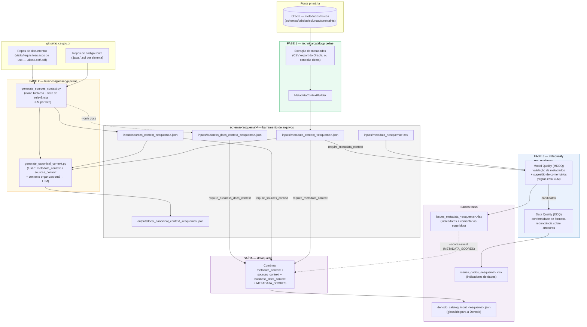

# Pipeline completo — Catálogo Técnico → Glossário de Negócio → Qualidade de Dados → Catálogo Denodo

Documentação de referência para rodar os 3 schemas (`cadastro`, `receita2`, `sitram2`)
através dos 4 projetos irmãos (`technicalcatalogpipeline`, `businessglossarypipeline`,
`dataquality`, e o repositório de dados `schema/`), gerando as duas saídas esperadas:

1. **Indicadores de qualidade de dados + comentários sugeridos** (`dataquality/run_quality.py`)
2. **Documento de glossário/catálogo para a Denodo** (`dataquality/scripts/build_denodo_catalog_input.py`)

> Este documento substitui `docs/diagrama_fases.md` (que descreve a arquitetura antiga,
> anterior à separação em `technicalcatalogpipeline`/`businessglossarypipeline`).

---

## 1. Diagrama de alto nível



Regra de desacoplamento: nenhum dos 3 programas importa código dos outros — eles trocam
apenas arquivos dentro de `schema/<esquema>/{inputs,outputs}/`. `dataquality` pode chamar os
outros dois via subprocesso (`infrastructure/io/pipeline_bridge.py`) **somente** se o arquivo
esperado estiver ausente e a flag `require_*` correspondente estiver `true`.

---

## 2. Pré-requisitos (antes de qualquer execução)

| # | Item | Status atual | Ação necessária |
|---|------|---------------|------------------|
| 1 | `businessglossarypipeline/config/catalogo.config.json` → `sources_repos` | ✅ `cadastro` e `sitram2` adicionados (§4.1) | pendente apenas o repositório `sitram/sitram3` (URL não encontrada — ver §4.1) |
| 2 | `.checkouts/` (blobless clones) | criados sob demanda na primeira execução | nenhuma ação — automático |
| 3 | Token git pessoal no keyring (`businessglossary-git`, usuário `49756615`) | ✅ confirmado — mesmo token dá acesso a `cadastro-business`, `cadastro-web`, `doc-cnpj-alfa`, `sitram-parent`, `sitram/docs` | nenhuma ação |
| 4 | Segredo Azure OpenAI no keyring (`dataquality-azure-openai` / `catalogo-semantico-azure-openai`, username `azure-openai`) | assumido já configurado (usado por `receita2`) | confirmar com `scripts/store_keyring_secret.py --service <serviço> --username azure-openai` se ainda não gravado |
| 5 | Senha Oracle no keyring (`dataquality-oracle`) | assumido já configurado | idem, via `store_keyring_secret.py` |
| 6 | `metadata_context_*.json` / `sources_context_*.json` já existem em `schema/{cadastro,receita2,sitram2}/inputs/` | **sim, mas datados de 2026-03-25** — anteriores às "muitas alterações" recentes nos 4 projetos | rodar Fase 1 e Fase 2 de novo para regenerar (ver §4/§5) — ou apagar os arquivos antigos para forçar `pipeline_bridge` a regenerar sob demanda |
| 7 | Amostras de código de documento (`schema/<esquema>/inputs/<ESQUEMA>.<TABELA>.<COLUNA>.csv`, um valor por linha) para a fase **Data Quality (DDQ)** | ✅ **feito** — já colocados para os 3 esquemas (23 arquivos em `cadastro`, 15 em `receita2`, 14 em `sitram2`) | nenhuma ação — ver nota abaixo sobre o mecanismo real de DDQ hoje |

> **Nota sobre DDQ hoje**: em `app/use_cases/run_data_quality.py`, o caminho genérico de
> amostras por tabela inteira (`CsvSampleSource` / `sample_<tabela>.csv`, usado para
> Format Conformity genérica e Detecção de Redundância) está **comentado/desativado
> temporariamente** no código. O único mecanismo ativo hoje é o
> `DocumentCodeQualityAnalyzer` (via `DocumentCodeLoader`), que lê exatamente os arquivos
> `<ESQUEMA>.<TABELA>.<COLUNA>.csv` (um valor de CPF/CNPJ/CGF por linha) já colocados em
> `schema/<esquema>/inputs/` — e alimenta o indicador **MQID015 (Conformidade de código de
> documento)**. Ou seja: o pré-requisito de dados de amostra para a DDQ **já está satisfeito**
> para os 3 esquemas com o que foi colocado na pasta; `data_quality.sample_source` no config
> não tem efeito prático enquanto esse trecho continuar comentado.

---

## 3. FASE 1 — Catálogo Técnico (`technicalcatalogpipeline`)

```bash
cd ../technicalcatalogpipeline
python scripts/build_technical_catalog.py --config config/catalog.config.json --schema cadastro --schema receita2 --schema sitram2
```

`config/catalog.config.json` já tem `schemas: ["cadastro", "receita2", "sitram2"]` (atualizado); o comando acima com `--schema` repetido também funciona e tem precedência sobre o config:

| Parâmetro | Valor recomendado | Observação |
|---|---|---|
| `schema_root` | `"schema"` | raiz relativa ao workspace (`Implementation/schema`) |
| `schemas` | `["cadastro", "receita2", "sitram2"]` | ou usar `--schema` na CLI (tem precedência) |
| `metadata_source` | `"csv"` | lê `metadata_<esquema>.csv` já existente em `inputs/`; alternativas: `"oracle"`, `"s3"`, `"athena"` |
| `delete_cols` | `["COLUMN_ID","NUM_BUCKETS","DENSITY"]` | colunas descartadas do CSV bruto |
| `db_*` (se `metadata_source: "oracle"`) | `db_type`, `db_connection_uri`/`db_host`+`db_port`+`db_service_name`, `db_username`, `db_password_keyring_service`, `db_password_keyring_username` | só necessário se decidirem ler direto do Oracle em vez do CSV já exportado |
| `metadata_db_schemas` | `["cadastro","receita2","sitram2"]` | só usado com `metadata_source: "oracle"` |

**Saída**: `schema/<esquema>/inputs/metadata_context_<esquema>.json`

---

## 4. FASE 2 — Glossário de Negócio / Contexto de Fontes (`businessglossarypipeline`)

### 4.1 Repositórios git dos 3 sistemas — ✅ configurado

`businessglossarypipeline/config/catalogo.config.json` → `sources_repos` já tem `cadastro` e
`sitram2` (além de `receita2`), reaproveitando o mesmo usuário/token (`49756615` /
`businessglossary-git`) já usado para `receita2`:

| Esquema | Repositório | `ref` (branch) | `content_type` |
|---|---|---|---|
| cadastro | `cadastro/cadastro-business` | `main` | source |
| cadastro | `cadastro/cadastro-web` | `main` | source |
| cadastro | `cadastro/doc-cnpj-alfa` | `master` | docs (site Astro/Starlight — `.md`/`.mdx`) |
| sitram2 | `sitram/sitram-parent` | `develop` | source |
| sitram2 | `sitram/sitram3` | ⚠️ **não encontrado** (ver nota) | source |
| sitram2 | `sitram/docs` | `master` | docs |

Os branches (`ref`) acima foram **confirmados via `git ls-remote --symref`** contra
`git.sefaz.ce.gov.br` (não são um palpite) — exceto `sitram3`.

> ⚠️ **`sitram/sitram3` retornou "project not found"** com o token/usuário `49756615`. Ou o
> caminho do repositório é outro (ex.: `sitram-web`, `sitram-app`, um nome de módulo dentro do
> `sitram-parent`), ou esse usuário não tem acesso a ele. Preciso do caminho exato (ou de outro
> usuário/token com acesso) antes de rodar a Fase 2 para `sitram2` incluindo esse repositório —
> os outros dois repos de `sitram2` (`sitram-parent`, `docs`) já estão prontos.

**Filtro de relevância — regras aplicadas agora (a seu pedido):**

Adicionado um novo bloco `relevance_filter` em `catalogo.config.json`:

```json
"relevance_filter": {
  "max_file_age_days": 365,
  "exclude_dirname_substrings": ["test"]
}
```

- **Idade**: qualquer arquivo cujo commit mais recente tenha mais de 365 dias é descartado antes
  de baixar conteúdo ou chamar o LLM. A data vem de `git log --name-only` sobre o clone
  "blobless" já feito (metadados de commit, sem baixar blobs — sem custo de rede/token extra).
  Arquivo sem data conhecida é mantido (falha aberta).
- **Pastas "test"**: qualquer segmento de pasta que **contenha** "test" (substring, não só nome
  exato) é descartado — cobre `test/`, `tests/` (já cobertos antes) e também `testeIntegracao/`,
  `ContestacaoTeste/` etc.
- Ambas testadas com dados sintéticos antes de aplicar (`core/relevance_filter.py`); reduzem o
  volume de arquivos antes de qualquer chamada de LLM, então diminuem tempo e tokens como pedido.
- `--dry-run` mostra o motivo de cada descarte, incluindo `"desatualizado (ultima alteracao
  AAAA-MM-DD)"` e `"pasta contem 'test'"`.

**Achado durante o teste de conectividade**: `doc-cnpj-alfa` é um site de documentação
Astro/Starlight (`.md`/`.mdx`), não `.odt`/`.docx`/`.pdf` como `receita-docs`. Adicionei suporte
a `.md`/`.mdx` em `core/document_text.py` e `core/relevance_filter.py` (`DOCUMENT_EXTENSIONS`)
para que esse repositório não seja 100% descartado por extensão.

### 4.2 Rodar por esquema (dry-run antes de gastar chamadas de LLM)

```bash
cd ../businessglossarypipeline
python scripts/generate_sources_context.py --schema cadastro --dry-run
python scripts/generate_sources_context.py --schema cadastro --system-name cadastro --package-root <pacote.java.raiz>

python scripts/generate_sources_context.py --schema sitram2 --dry-run
python scripts/generate_sources_context.py --schema sitram2 --system-name sitram2 --package-root <pacote.java.raiz>

python scripts/generate_sources_context.py --schema receita2   # já configurado; roda de novo p/ atualizar
```

Se houver repositórios de documentos (`content_type: "docs"`, como `receita-docs.git`) para
`cadastro`/`sitram2`, adicionar também e rodar com `--only docs` para gerar
`business_docs_context_<esquema>.json`.

### 4.3 Fundir num Contexto Local Canônico (semente do glossário)

```bash
python scripts/generate_canonical_context.py --config config/catalogo.config.json
```

| Parâmetro (`catalogo.config.json`) | Valor atual | Observação |
|---|---|---|
| `schema_root` | `"schema"` | |
| `organizational_context_path` | `businessglossarypipeline/docs/organizational_context_value_chain_sefaz_ce.json` | contexto da cadeia de valor, já compartilhado pelos 3 esquemas |
| `schemas` | `["sitram2","receita2","cadastro"]` | já correto |
| `batching.max_batch_bytes` | `40000` | tamanho de lote enviado ao LLM |
| `checkouts_root` | `".checkouts"` | pasta local dos clones blobless |
| `sources_repos.<schema>` | ver §4.1 | **pendente para `cadastro`/`sitram2`** |
| `llm.enabled` | `true` | |
| `llm.api_type` / `model` / `base_url` / `api_version` | `azure` / `gpt-4o-mini` / endpoint SEFAZ | mesmo endpoint usado pelo `dataquality` |
| `llm.api_key_keyring_service` / `api_key_keyring_username` | `catalogo-semantico-azure-openai` / `azure-openai` | |

**Saída**: `schema/<esquema>/inputs/sources_context_<esquema>.json` (e `business_docs_context_<esquema>.json`
quando houver docs) + `schema/<esquema>/outputs/local_canonical_context_<esquema>.json`.

---

## 5. FASE 3 — Qualidade de Dados (`dataquality/run_quality.py`) → **Saída 1**

```bash
cd ../dataquality
python run_quality.py --config-json config/run_quality.config.json
```

### 5.1 Alterações necessárias em `config/run_quality.config.json`

| Parâmetro | Valor anterior | Valor aplicado | Por quê |
|---|---|---|---|
| `include_schemas` | `["receita2"]` | ✅ `["cadastro","receita2","sitram2"]` | único campo que controla os 3 esquemas processados (top-level; nem `model_quality` nem `data_quality` sobrescrevem `include_schemas`, então basta mudar aqui) |
| `llm_comment_generation.enabled` | `false` | ✅ `true` | liga o gerador de comentários via LLM |
| `llm_comment_generation.comment_generation_strategy` | `"rules"` | ✅ `"rules"` (mantido) | com `enabled: true` **e** `strategy: "rules"`, o pipeline preenche `SUGGESTED_VALUE`/`SUGGESTED_VALUE_RULES` por regras **e** `SUGGESTED_VALUE_LLM` via LLM lado a lado, em `METADATA_QUALITY_ISSUES` (colunas MQME008/MQME027 — comentário de coluna/tabela). Trocar para `"llm"` inverteria a prioridade (LLM vira `SUGGESTED_VALUE` primário) — **não é o que foi pedido**, que é regras primário + LLM cobrindo os nulos como comparação |
| `telemetry_enabled` | `false` | `false` (já estava desligada) | nada a fazer |
| `telemetry_output` | `false` | `false` (já estava desligada) | nada a fazer |
| `metadata_db_schemas` (top-level e em `model_quality`/`data_quality`) | `["receita2"]` | ✅ `["cadastro","receita2","sitram2"]` | só importa se algum dia trocarem `metadata_source` para `"oracle"`; atualizado por consistência |
| `data_quality.sample_source` | `"csv"` | `"csv"` (mantido) | sem efeito prático hoje — ver nota no §2 item 7 (caminho de amostra por tabela está desativado no código; DDQ real usa `DocumentCodeLoader`) |

Edições já aplicadas em `dataquality/config/run_quality.config.json` e em
`technicalcatalogpipeline/config/catalog.config.json` (campo `schemas`, mesma lista de 3 esquemas).
Pendente apenas: `sources_repos.cadastro`/`sources_repos.sitram2` em
`businessglossarypipeline/config/catalogo.config.json` (§4.1 — aguardando as URLs git).

### 5.2 Referência completa de parâmetros (`--print-config-template`)

| Bloco | Campo | Descrição |
|---|---|---|
| raiz | `run_model_quality` / `run_data_quality` | liga/desliga cada fase (MDDQ = metadados, DDQ = dados) |
| raiz | `telemetry_enabled` / `telemetry_output` | grava (ou não) JSON de telemetria em `app/telemetry/` |
| raiz | `delete_cols`, `plural_exceptions` | normalização de nomes/CSV |
| raiz | `db_type`, `metadata_source`, `output_type` | tipo de banco, origem dos metadados (`csv`/`oracle`/`s3`/`athena`), destino do relatório (`excel`/`postgresql`/...) |
| raiz | `db_*` / `output_db_*` | credenciais de leitura (Oracle) e de gravação dos resultados (schema `QUALIDADE_DADOS` em `sd2dbc22.sefaz-ce.gov.br`) |
| raiz | `include_schemas` | **lista de esquemas processados** (ver 5.1) |
| raiz | `exclude_tables` | padrões de tabela ignorados (views, backups, logs Oracle) |
| raiz | `require_metadata_context` | se `metadata_context_<schema>.json` faltar, chama `technicalcatalogpipeline` automaticamente |
| `llm_comment_generation` | `enabled`, `comment_generation_strategy`, `model`, `base_url`, `api_version`, `api_key_keyring_service/username`, `temperature`, `max_output_tokens`, `timeout_seconds` | geração de comentários (ver 5.1) |
| `validation_config` | `max_table_len`, `max_column_len`, `prefix_names`, `pk_prefix`, `fk_prefix`, `type_naming.*` | regras de nomenclatura/tipagem (MQME/MQID) |
| `scoring` | `metadata_metric_weights` (MQID001-014), `data_quality_metric_weights`, `mddq_phase_weight` (30), `ddq_phase_weight` (70) | pesos do score agregado |
| `model_quality` | `base_folder` (`../schema`), `metadata_source`, `metadata_query_file`, `db_*`, `metadata_db_schemas` | overrides só da fase de metadados |
| `data_quality` | `metadata_base_folder`, `sample_base_folder`, `metadata_source`, `sample_source`, `db_*`, `db_authentication_type`, `sample_query_template`, `sample_limit` (1000), `skip_document_code_analysis` | overrides só da fase de dados |

**Saídas**: `issues_metadata_<esquema>.xlsx` (MDDQ — inclui `METADATA_QUALITY_ISSUES` com
`SUGGESTED_VALUE`/`SUGGESTED_VALUE_RULES`/`SUGGESTED_VALUE_LLM`, e `METADATA_SCORES`) e
`issues_dados_<esquema>.xlsx` (DDQ), um par por esquema.

---

## 6. SAÍDA — Catálogo Denodo (`dataquality/scripts/build_denodo_catalog_input.py`) → **Saída 2**

```bash
cd dataquality
python scripts/build_denodo_catalog_input.py --schema cadastro --scores-excel <caminho para issues_metadata_cadastro.xlsx gerado na Fase 3>
python scripts/build_denodo_catalog_input.py --schema receita2 --scores-excel <...>
python scripts/build_denodo_catalog_input.py --schema sitram2 --scores-excel <...>
```

| Parâmetro CLI | Default | Observação |
|---|---|---|
| `--schema` | obrigatório | `cadastro`, `receita2` ou `sitram2` |
| `--base-folder` | `../schema` | raiz com `<schema>/inputs` e `<schema>/outputs` |
| `--output-dir` | `<base-folder>/<schema>/outputs` | onde grava `denodo_catalog_input_<schema>.json` |
| `--scores-excel` | nenhum (⇒ `quality_score` fica `null`) | apontar para o `.xlsx` da Fase 3, sheet `METADATA_SCORES` |
| `--scores-sheet` | `METADATA_SCORES` | relatórios antigos usam `QUALITY_SCORES` (layout diferente) |
| `--require-metadata-context` | `true` | se faltar, chama `technicalcatalogpipeline` |
| `--require-sources-context` | `false` | se `true` e faltar, chama `businessglossarypipeline` — **pode gastar uma chamada real de LLM**; como os arquivos já existem em `schema/*/inputs/`, deixar `false` é seguro (usa o que já está no disco) |
| `--require-business-docs-context` | `false` | idem, mas para os documentos de visão/requisitos (`--only docs`) — pode disparar **muitas** chamadas de LLM (uma por documento); manter `false` a menos que os docs de `cadastro`/`sitram2` ainda não tenham sido processados |

**Saída**: `schema/<esquema>/outputs/denodo_catalog_input_<esquema>.json` — este é o
documento de glossário/catálogo técnico+negócio pronto para alimentar a plataforma Denodo.

---

## 7. Resumo — as duas saídas esperadas

| Saída | Comando | Depende de |
|---|---|---|
| **1. Indicadores de qualidade de dados + comentários** | `python run_quality.py --config-json config/run_quality.config.json` | Fase 1 (`metadata_context_*.json`) sempre; amostras de código de documento para a parte DDQ (✅ já disponíveis, §2 item 7) |
| **2. Glossário/catálogo Denodo** | `python scripts/build_denodo_catalog_input.py --schema <esquema> --scores-excel <xlsx da Saída 1>` × 3 | Fase 1 + Fase 2 (`sources_context_*.json`, e opcionalmente `business_docs_context_*.json`) |

### Status atual (2026-08-13)

- ✅ Fase 1 (`technicalcatalogpipeline`): configurada para os 3 esquemas (`schemas` em `catalog.config.json` atualizado); contextos existentes em `schema/*/inputs/metadata_context_*.json` estão desatualizados (25/03) e devem ser regenerados.
- ✅ Fase 2 (`businessglossarypipeline`): `sources_repos` configurado para os 3 esquemas (§4.1), filtro de relevância com idade máxima de 365 dias e exclusão de pastas "test" aplicado; falta apenas confirmar o repositório `sitram/sitram3` para `sitram2` ficar 100% completo.
- ✅ Fase 3 (`dataquality` — Saída 1): `include_schemas` e `llm_comment_generation.enabled` já aplicados; amostras de código de documento já em disco para os 3 esquemas; pronto para rodar.
- ⏳ Saída 2 (Denodo): pronta para rodar assim que a Fase 1/2 forem regeneradas (ou pode rodar já com os contextos existentes, mais antigos, se for aceitável por ora).
